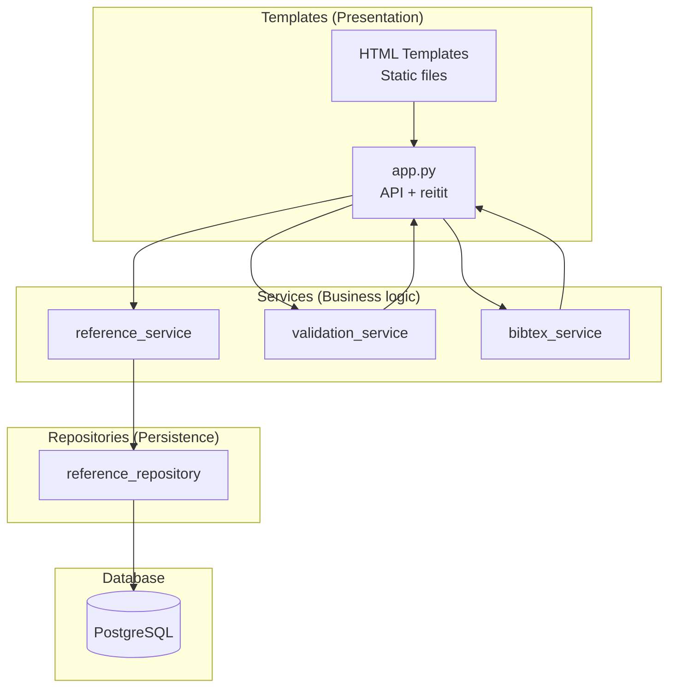
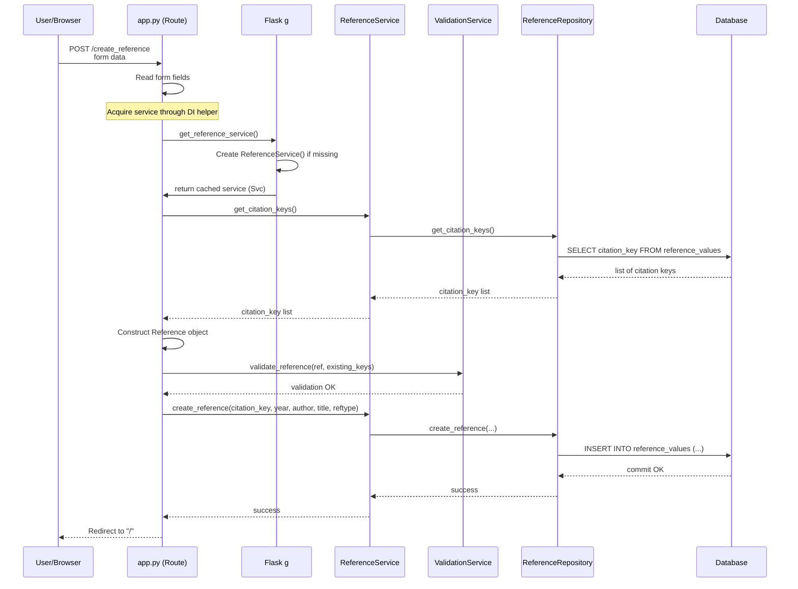
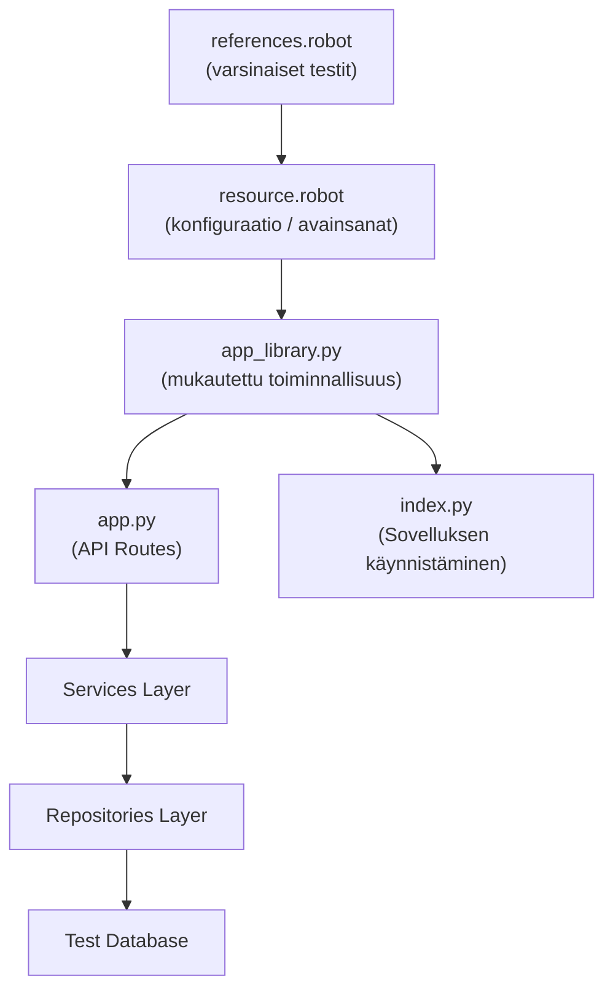
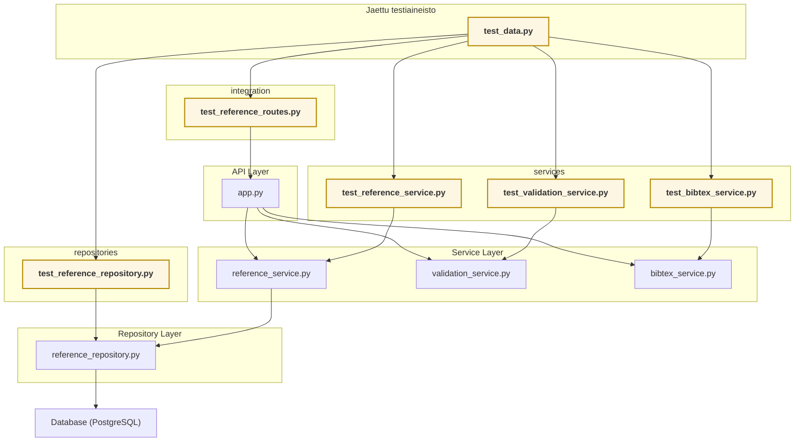

# Arkkitehtuurikaavio: UI > Service > Repository > Database 
Projektissa on käytössä kerrosarkkitehtuuri. Lue aiheesta lisää täältä: 
[HY Ohjelmistotuotannon kurssi - Kerrosarkkitehtuuri](https://ohjelmistotuotanto-hy.github.io/osa4/#kerrosarkkitehtuuri)

  

# Sekvenssikaavio: 
## API → Service → Repository → Database

  

# Kaavio: Robot Framework -testit käyttävät app_librarya

  

# Testit ja niiden suhde ohjelmakoodiin

